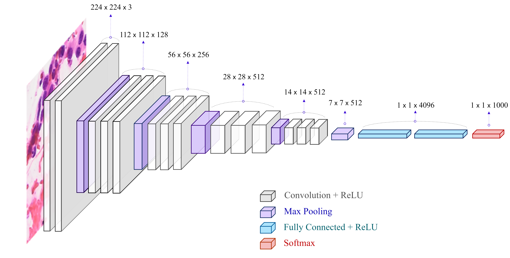
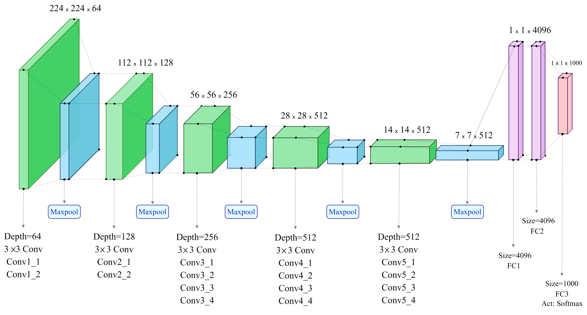
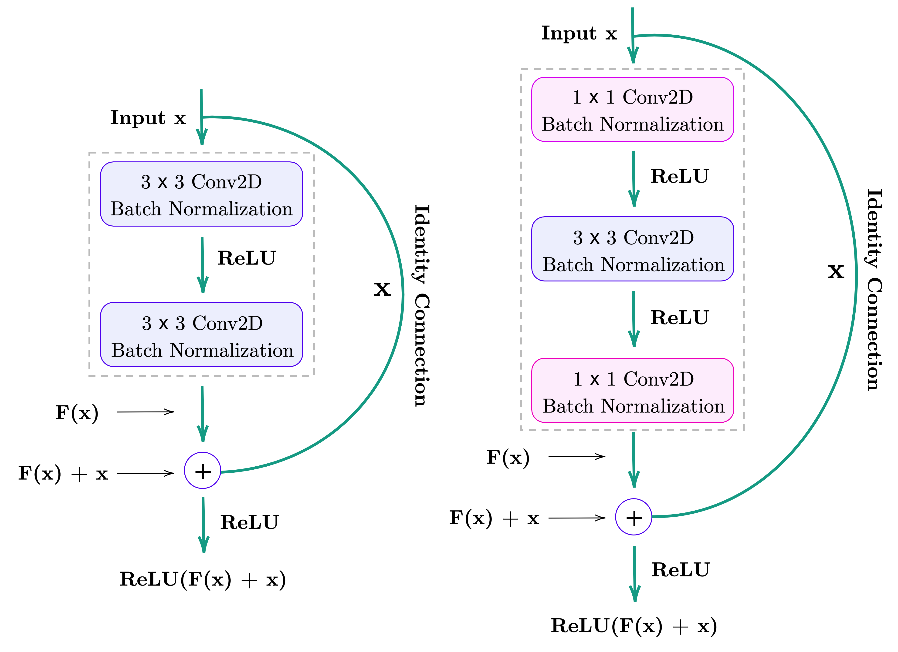
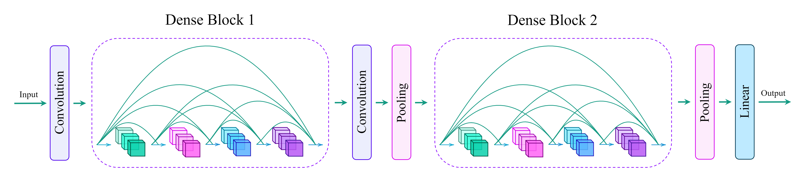
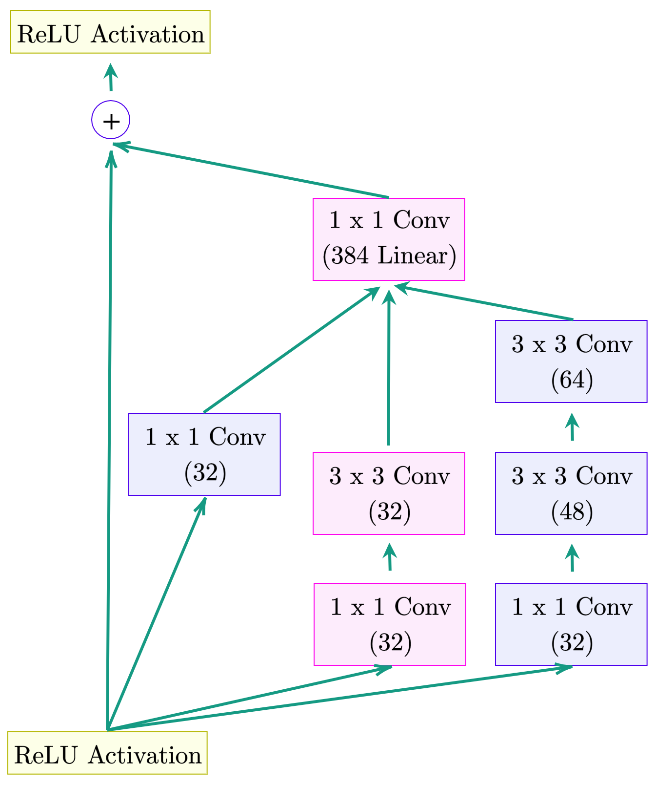
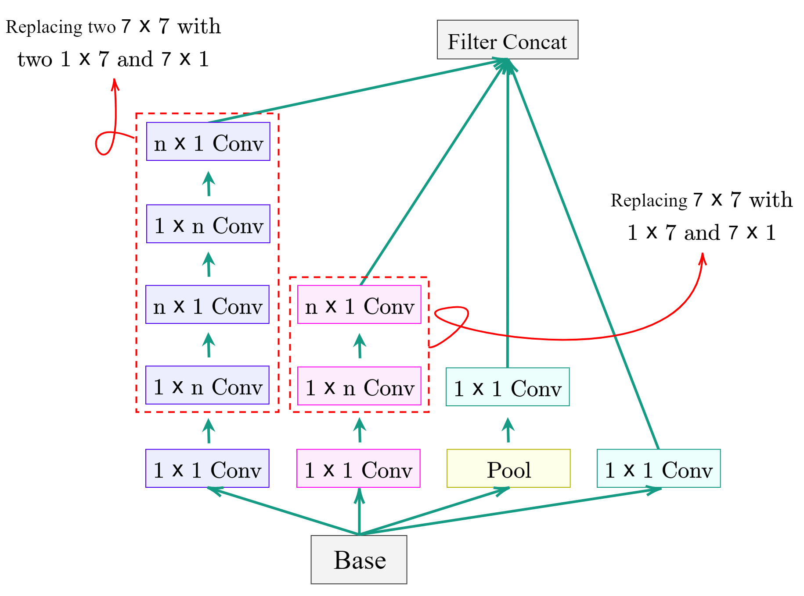

<!-- 
 -->
  <!--  -->
<!-- 
 -->
<h1 align="left"> CDTL: Compatible-domain Transfer Learning for Breast Cancer Classification with Limited Annotated Data </h1>

<!-- 
  -->
<!--  -->
<!-- 
 -->

<!-- TABLE OF CONTENTS -->
<h2 id="table-of-contents"> Table of Contents</h2>

<!--  -->

  
Table of Contents

  <ol>
    <li><a href="#overview"> ➤ Overview </a></li>
    <li><a href="#folder-structure"> ➤ Folder Structure </a></li>
    <li><a href="#prerequisites"> ➤ Prerequisites </a></li>
    <li><a href="#dataset"> ➤ Dataset </a></li>
    <li><a href="#models"> ➤ Deep Learning Models </a></li>
      <ul>
        <li><a href="#VGG-16"> VGG-16 </a></li>
        <li><a href="#VGG-19"> VGG-19 </a></li>
        <li><a href="#ResNet101-V2"> ResNet101-V2 </a></li>
        <li><a href="#DenseNet-169"> DenseNet-169 </a></li>
        <li><a href="#Inception-V3"> Inception-V3 </a></li>
        <li><a href="#InceptionResNet-V2"> InceptionResNet-V2 </a></li>
      </ul>
    <li><a href="#license"> ➤ License </a></li>
    <li><a href="#reference"> ➤ Reference </a></li>
  </ol>

The content of this repository will be updated soon.   This will include code and pre-trained models.  If you want to get more information, feel free to contact us (<a href="mailto:webmaster@example.com">ma.shamshiri@gmail.com</a>).

<!-- OVERVIEW -->
<h2 id="overview"> Overview</h2>

 
The aim of this study is to design a transfer learning framework to classify breast cancer cytological images into two categories: benign and malignant. Taking into account the ineffectiveness of employing natural images in TL to solve biomedical-domain problems, we propose the idea of Compatible-domain Transfer Learning (CDTL). This means that instead of using natural images (i.e. ImageNet) that are not essentially compatible with medical data, the pre-training phase of the model is performed employing histopathological images. We then fine-tune pre-trained models on the target data set containing limited cytological images).

 
  

<!-- FOLDER STRUCTURE -->
<h2 id="folder-structure"> Folder Structure</h2>

    data
    .
    │
    ├── dataset50%
        ├── 64px
        │   │
        │   ├── train
        │   │   ├── benign
        │   │   ├── malignant
        │   │   
        │   ├── validation
        │   │   ├── benign
        │   │   ├── malignant
        │   │
        │   ├── test
        │       ├── benign
        │       ├── malignant
        │
        ├── 128px
        │   │
        │   ├── train
        │   │   ├── benign
        │   │   ├── malignant
        │   │   
        │   ├── validation
        │   │   ├── benign
        │   │   ├── malignant
        │   │
        │   ├── test
        │       ├── benign
        │       ├── malignant
        │
        ├── 256px
            │
            ├── train
            │   ├── benign
            │   ├── malignant
            │   
            ├── validation
            │   ├── benign
            │   ├── malignant
            │
            ├── test
                ├── benign
                ├── malignant

  :house: <a href="#table-of-contents">  Back to Table of Contents</a> 

<!-- PREREQUISITES -->
<h2 id="prerequisites">Prerequisites</h2>

  
  
  
  
  
  
  
  
  
  

 1. Open a `Command Prompt` (NOT `Windows PowerShell`) or a `Terminal`
 2. Create a conda environment `conda create -n is python=3.6.6 -y`
 3. Activate this environment `activate is` (Windows) or `source activate is` (Linux/macOS)
 4. Install the following packages `tensorflow`, `keras`, `opencv`, `matplotlib`, `numpy`, `pandas`, `scikit-learn`, and `notebook`:         
      * <a href="https://www.python.org/" target="_blank">Python (3.6)</a>
      * <a href="https://www.tensorflow.org/" target="_blank">TensorFlow (2.3.2)</a> - `pip install tensorflow==2.3.2`
      * <a href="https://keras.io/" target="_blank">Keras (2.1.6)</a> - `pip install keras==2.1.6`
      * <a href="https://opencv.org/" target="_blank">OpenCV (4.4.0)</a> - `pip install opencv==4.0.0`
      * <a href="https://matplotlib.org/" target="_blank">Matplotlib (3.5.1)</a> - `pip install matplotlib==3.5.1`
      * <a href="https://numpy.org/" target="_blank">NumPy (1.18.4)</a> - `pip install numpy==1.18.4`
      * <a href="https://pandas.pydata.org/" target="_blank">Pandas (1.1.3)</a> - `pip install pandas==1.1.3` 
      * <a href="https://scikit-learn.org/stable/" target="_blank">Sklearn (0.23.2)</a> - `pip install scikit-learn==0.23.2`
      * <a href="https://jupyter.org/" target="_blank">Jupyter (4.7.1)</a> - `pip install notebook`
 

  :house: <a href="#table-of-contents">  Back to Table of Contents</a> 

<!-- DATASET -->
<h2 id="Dataset"> Dataset</h2>

The target data set investigated in this research are digital cytology images of breast cancer, which is an archival collection of samples taken from patients at the Regional Hospital in Zielona Gora, Poland. The data set consists of 550 microscopic images of cytological specimens taken from 50 patients using FNB without aspiration (under ultrasonography support) with 0.5-millimeter needles. To form a data set, cytological material extracted from the patient is digitized into virtual slides using the Olympus VS120 Virtual Microscopic System. A virtual slide is a massive digital image with an average size of 200,000 x 100,000 pixels. Since not all parts of a slide necessarily contain useful medical information for analysis, a cytologist manually selected 11 distinct regions of interest (ROI) which were converted to 8 bit/channel RGB TIFF files of size 1583 x 828 pixels.

 

 
  

  :house: <a href="#table-of-contents">  Back to Table of Contents</a> 

<!-- MODELS -->
<h2 id="Dataset"> Deep Learning Models</h2>

Deep learning techniques have been widely used by researchers as a powerful tool in a wide range of imaging domains - such as classification detection segmentation, etc. The extensive applications of DL in various fields have accelerated its development and progress. One of the most popular types of DL models is known as convolutional neural network, which has a different structure compared to a regular neural network. CNNs were primarily developed to process image data, and are perhaps the most flexible type of DL models for image classification problems. Given the capability of deep CNNs to learn generalizable descriptors directly from images, they seem to be the ideal solution to most pattern recognition problems. Given all the advantages cited for CNNs in image analysis tasks, in this study we examine six SOA deep CNNs that have already proven their capability in the ImageNet challenge. With the help of these networks, we solve the problem of classifying cytological images and by analytical comparison of the obtained results, we ultimately introduce the most efficient network. All the deep models used in this study were implemented in Python with Keras and Tensorflow libraries, the architecture of each of which is described in separate sections below.

 

<!-- VGG-16 -->
<h3 id="VGG-16"> VGG-16</h3>

VGG-16 is a CNN architecture proposed by Simonyan, et al. (2014), which was used to win ILSVRC competition in 2014. VGG-16 made the improvement over AlexNet, another famous model submitted to ILSVRC-2012, by replacing the relatively large 11 x 11 and 5 x 5 filters with a stack of 3 x 3 filters with a stride 1. The use of small-size filters had the advantage of low computational complexity by reducing the number of parameters. Simonyan and Zisserman also suggested enhancing the model capacity by deepening the network from 8 layers, previously used in AlexNet, to 16-19 layers, which greatly helped improve model performance. These modifications and presenting a novel deep CNN architecture resulted in a significant increase in the top-5 test accuracy of the model and ranked VGG-16 first in localization and second in classification. 16 in VGG-16 represents the sixteen layers in it, which makes it a relatively large network with about 138 million parameters. Due to the depth and large number of FC nodes, the size of VGG-16 has reached more than 500 MB, which has made the deployment of the model a somewhat tedious task. Having too many parameters in the model can also increase the risk of overfitting, as well as makes it difficult to pass gradient updates through the entire network. So, in addition to this model, we decided to use smaller and lighter networks in terms of the number of parameters in our experiments so that we can compare the capacity and performance of different models. The architecture of VGG-16 is pretty simple to understand and explain. Despite the simplicity of the architecture, its performance is such convincing that it is still used as a baseline in various CV tasks.

 
  

<!-- VGG-19 -->
<h3 id="VGG-19"> VGG-19 </h3>

VGG-19, a variant of VGG networks, is a deep CNN architecture, having been trained in the ImageNet challenge (ILSVRC) 1000-class classification task. 
The architecture of VGG-19 is pretty much similar to that of VGG-16 except that there are three additional convolution layers distributed in the last three blocks of the VGG-19. This brings the total number of network layers to 19, sixteen convolution layers having trainable weights followed by three FC layers.
The VGG-19 network is used as one of the deep networks for the pre-training stage in this research so that we can investigate the effect of increasing the number of convolution layers on the model performance in the classification task. The VGG-19 architecture is as shown in.

 

 
  

<!-- ResNet101-V2 -->
<h3 id="ResNet101-V2"> ResNet101-V2 </h3>

The Residual Network (known as ResNet) is a special type of neural network developed by He, et al. (2016) that ranked first in the 2015 ILSVRC image recognition and segmentation challenges. The ResNet architecture has certainly been one of the most pioneering works in the CV community in recent years, as it introduces the concept of identity shortcut connections (known as skip connections). The idea of using skip connections in ResNet was to avoid the problem of vanishing gradients in the network and to mitigate the accuracy saturation issues. In general, the deeper a network becomes (containing more layers), the greater its capacity to solve more complex tasks, and usually helps to improve the performance of classification and identification tasks. On the other hand, as we continue to add more layers to the neural network, it becomes very difficult to train, and the accuracy of the model begins to saturate and then decreases. This is a problem that ResNet has greatly mitigated with residual blocks, allowing gradients to pass through an additional shortcut channel. As illustrated in the figure, the residual block has two 3 x 3 convolution layers, each followed by a batch normalization layer and a ReLU activation function. Besides, there is a direct connection that passes through the layer in between and connects the input x to the addition operator. The ResNet architecture is clearly inspired by the VGG-19, except that skip connections have been added to it. There are a few variants of ResNet architecture, e.g., ResNet-34, ResNet-50, ResNet-101, ResNet-110, ResNet-152, ResNet-164 etc, the difference being essentially the number of layers used in them. The name of the network comes with a number that clearly indicates the number of layers used in that specific architecture. In this research, we use ResNet-101 as another deep model to solve the classification problem and compare its performance with other SOA networks. ResNet-101 is a 101-layer deep network consisting of 44.6 million parameters.

 

 
  

<!-- DenseNet-169 -->
<h3 id="DenseNet-169"> DenseNet-169 </h3>

Dense convolutional network (DenseNet) developed by Huang, et al. (2017) is another type of CNN, similar to ResNet, was proposed to solve the vanishing gradient problem. The DenseNet architecture has a narrow-layered structure that uses cross-layer connectivity, meaning that each layer receives additional inputs from all preceding layers and transmits its own feature maps to all subsequent layers. This operation is performed using dense connections between layers through several dense blocks embedded in the network. A dense block itself consists of multiple convolution blocks, each using the same number of output channels. Having such a structure in the network provides direct access of each layer to the gradients through the loss function, and also helps to share the important features learned by each layer, which in turn boost information flow through the whole network. The described mechanism, in addition to strengthening feature propagation, significantly reduces the number of learning parameters across the network, thus making the network training process more efficient. DenseNet has been developed in several versions so far, including DenseNet-121, DeneNet-161, DeneNet-169 and DenseNet-201, of which we employ DenseNet-169 variant in this study. Despite having a depth of 169 layers, DenseNet-169 has relatively few parameters compared to other models and is still able to handle the vanishing gradient problem well.

 

 
  

<!-- Inception-V3 -->
<h3 id="Inception-V3"> Inception-V3 </h3>

Inception networks currently have four versions, namely GoogleNet (also known as Inception-V1), Inception-V2, Inception-V3, and Inception-V4. The GoogleNet, which achieved SOA results for classification and detection in ILSVRC-2014, was the first network to introduce a key innovation called the Inception module. The main objective of the Inception networks was to achieve higher accuracy and at the same time reduce the computational cost, both in terms of the number of parameters and memory resources. In this regard, instead of naively stacking large convolution operations, which are obviously computationally expensive, came up with the novel idea of using Inception modules. The Inception module is a block of parallel convolution layers that encapsulates filters of different sizes (e.g., 1 x 1, 3 x 3, 5 x 5) along with max-pooling layers to perform convolution operations on inputs. This, while helping to capture details at different scales, makes the network generally a bit wider than the previously presented networks. The output feature maps will ultimately be concatenated, and then connected to the next layer Inception modules. In this study, we use Inception-V3, an improved version of the previously introduced Inception networks, whose idea was to reduce the computational cost of the network without affecting generalization. The structure of the Inception module in this version is slightly different, and the large size filters ($5\times5$ and $7\times 7$) have been replaced with small and asymmetric filters (1x7, 1x5). The illustration of a canonical Inception module is shown in the figure. Replacing larger convolutions with smaller ones reduces learning parameters and thus speeds up the network training process.

 

 
  

<!-- InceptionResNet-V2 -->
<h3 id="InceptionResNet-V2"> InceptionResNet-V2 </h3>

InceptionResNet is a convolutional neural architecture developed based on a combination of inception structure and residual connection. Inspired by ResNet performance, InceptionResNet has a structure consisting of multiple-sized convolution filters combined with residual connections and employs a hybrid inception module in its architecture. The usage of residual connections not only avoids the degradation problem caused by deep structures, but also reduces the model training time. There are two sub-versions of InceptionResNet, namely V1 and V2. Both sub-versions have the same structure for the residual blocks and the only difference is in the hyperparameter settings. In this study, we use InceptionResNet-V2, which is significantly deeper than the previous Inception-V3, to classify cytological images. This model also requires roughly twice the memory and computation compared to Inception-V3, and has the potential to achieve higher accuracy in early epochs.

 

 
  

<!-- LICENSE -->
<h2 id="license"> License</h2>
© <a href="https://www.concordia.ca/research/cenparmi.html" target="_blank">CENPARMI</a> Lab - This code is made available under the <a href="https://www.gnu.org/licenses/gpl-3.0.en.html" target="_blank">GPLv3</a> License and is available for non-commercial academic purposes.

  :house: <a href="#table-of-contents">  Back to Table of Contents</a> 

<!-- REFERENCES -->
<h2 id="reference"> License</h2>
(BibTex ...)

  :house: <a href="#table-of-contents">  Back to Table of Contents</a> 

