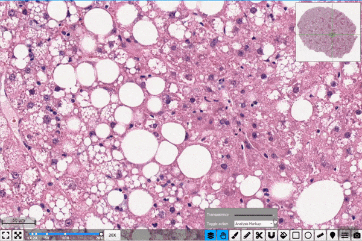

 
  

<h1 align="left"> CDTL: Compatible-domain Transfer Learning for Breast Cancer Classification with Limited Annotated Data </h1>

 
  

<!-- TABLE OF CONTENTS -->
<h2 id="table-of-contents"> :book: Table of Contents</h2>

  
Table of Contents

  <ol>
    <li><a href="#overview"> ➤ Overview</a></li>
    <li><a href="#project-files-description"> ➤ Project Files Description</a></li>
    <li><a href="#prerequisites"> ➤ Prerequisites</a></li>
    <li><a href="#dataset"> ➤ Dataset </a></li>
    <li><a href="#license"> ➤ License </a></li>
    <li><a href="#reference"> ➤ Reference </a></li>
  </ol>

<!-- OVERVIEW -->
<h2 id="overview"> :cloud: Overview</h2>

 
  The text goes here ...

<!-- PROJECT FILES DESCRIPTION -->
<h2 id="project-files-description"> :floppy_disk: Project Files Description</h2>

<ul>
  <li><b>search.py</b> - Where all of the search algorithms reside.</li>
  <li><b>searchAgents.py</b> - Where all of the search-based agents reside.</li>
  <li><b>pacman.py</b> - The main file that runs Pacman games. This file also describes a Pacman GameState types.</li>
  <li><b>game.py</b> - The logic behind how the Pacman world works.</li>
  <li><b>util.py</b> - Useful data structures for implementing search algorithms.</li>
</ul>

<h3>Some other supporting files</h3>
<ul>
  <li><b>graphicsDisplay.py</b> - Graphics for Pacman.</li>
  <li><b>graphicsUtils.py</b> - Support for Pacman graphics.</li>
  <li><b>textDisplay.py</b> - ASCII graphics for Pacman.</li>
  <li><b>ghostAgents.py</b> - Agents to control ghosts.</li>
  <li><b>keyboardAgents.py</b> - Keyboard interfaces to control Pacman.</li>
  <li><b>layout.py</b> - Code for reading layout files and storing their contents.</li>
  <li><b>autograder.py</b> - Project autograder.</li>
  <li><b>testParser.py</b> - Parses autograder test and solution files.</li>
  <li><b>testClasses.py</b> - General autograding test classes.</li>
  <li><b>test_cases/</b> - Directory containing the test cases for each scenario.</li>
  <li><b>searchTestClasses.py</b> - Project specific autograding test classes.</li>
</ul>

<!-- CREDITS -->
<h2 id="Prerequisites"> :scroll: Prerequisites</h2>

<!-- CREDITS -->
<h2 id="Dataset"> :scroll: Dataset</h2>

<!-- CREDITS -->
<h2 id="License"> :scroll: License</h2>

