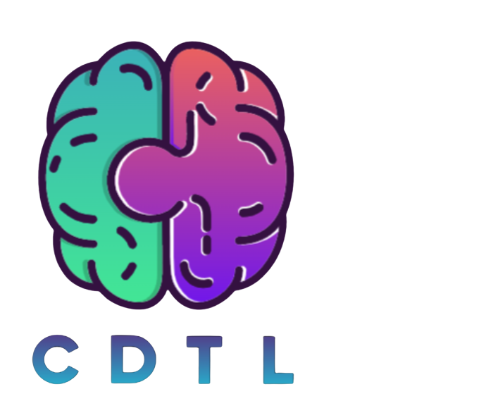
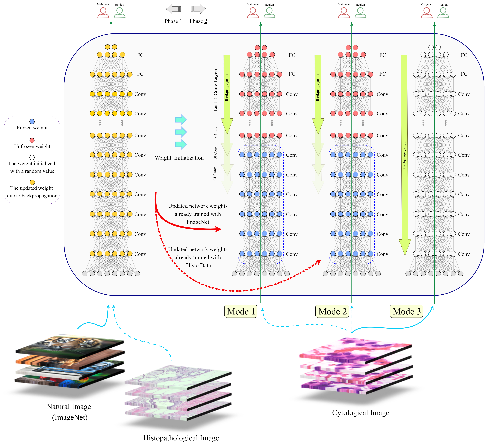
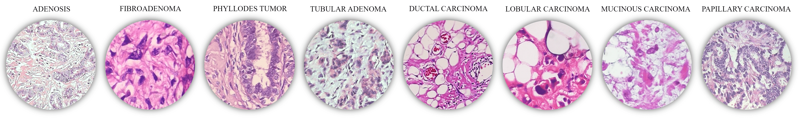

<!-- 
 -->
  <!--  -->
<!-- 
 -->
<h1 align="left"> CDTL: Compatible-domain Transfer Learning for Breast Cancer Classification with Limited Annotated Data </h1>

<!-- 
  -->
<!--  -->
<!-- 
 -->

<!-- TABLE OF CONTENTS -->
<h2 id="table-of-contents"> Table of Contents</h2>

<!--  -->

  
Table of Contents

  <ol>
    <li><a href="#overview"> ➤ Overview</a></li>
    <li><a href="#folder-structure"> ➤ Folder Structure</a></li>
    <li><a href="#prerequisites"> ➤ Prerequisites</a></li>
    <li><a href="#dataset"> ➤ Dataset </a></li>
    <li><a href="#license"> ➤ License </a></li>
    <li><a href="#reference"> ➤ Reference </a></li>
  </ol>

<!-- OVERVIEW -->
<h2 id="overview"> Overview</h2>

 
The aim of this study is to design a transfer learning framework to classify breast cancer cytological images into two categories: benign and malignant. Taking into account the ineffectiveness of employing natural images in TL to solve biomedical-domain problems, we propose the idea of Compatible-domain Transfer Learning (CDTL). This means that instead of using natural images (i.e. ImageNet) that are not essentially compatible with medical data, the pre-training phase of the model is performed employing histopathological images. We then fine-tune pre-trained models on the target data set containing limited cytological images).

 
  

<!-- FOLDER STRUCTURE -->
<h2 id="folder-structure"> Folder Structure</h2>

    data
    .
    │
    ├── dataset50%
        ├── 64px
        │   │
        │   ├── train
        │   │   ├── benign
        │   │   ├── malignant
        │   │   
        │   ├── validation
        │   │   ├── benign
        │   │   ├── malignant
        │   │
        │   ├── test
        │       ├── benign
        │       ├── malignant
        │
        ├── 128px
        │   │
        │   ├── train
        │   │   ├── benign
        │   │   ├── malignant
        │   │   
        │   ├── validation
        │   │   ├── benign
        │   │   ├── malignant
        │   │
        │   ├── test
        │       ├── benign
        │       ├── malignant
        │
        ├── 256px
            │
            ├── train
            │   ├── benign
            │   ├── malignant
            │   
            ├── validation
            │   ├── benign
            │   ├── malignant
            │
            ├── test
                ├── benign
                ├── malignant

  :house: <a href="#table-of-contents">  Back to Table of Contents</a> 

<!-- DATASET -->
<h2 id="Dataset"> Dataset</h2>

The target data set investigated in this research are digital cytology images of breast cancer, which is an archival collection of samples taken from patients at the Regional Hospital in Zielona Gora, Poland. The data set consists of 550 microscopic images of cytological specimens taken from 50 patients using FNB without aspiration (under ultrasonography support) with 0.5-millimeter needles. To form a data set, cytological material extracted from the patient is digitized into virtual slides using the Olympus VS120 Virtual Microscopic System. A virtual slide is a massive digital image with an average size of 200,000 x 100,000 pixels. Since not all parts of a slide necessarily contain useful medical information for analysis, a cytologist manually selected 11 distinct regions of interest (ROI) which were converted to 8 bit/channel RGB TIFF files of size 1583 x 828 pixels.

 

 
  

  :house: <a href="#table-of-contents">  Back to Table of Contents</a> 

<!-- LICENSE -->
<h2 id="license"> License</h2>
© <a href="https://www.concordia.ca/research/cenparmi.html" target="_blank">CENPARMI</a> Lab - This code is made available under the <a href="https://www.gnu.org/licenses/gpl-3.0.en.html" target="_blank">GPLv3</a> License and is available for non-commercial academic purposes.

  :house: <a href="#table-of-contents">  Back to Table of Contents</a> 

<!-- REFERENCES -->
<h2 id="reference"> License</h2>
(BibTex ...)

  :house: <a href="#table-of-contents">  Back to Table of Contents</a> 

